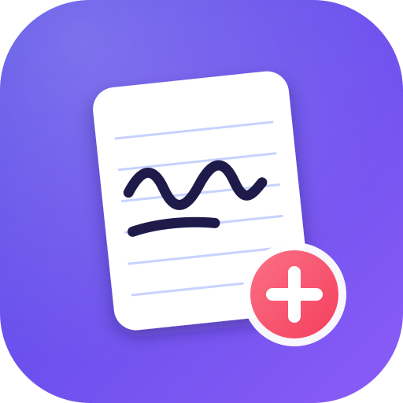

#  Note+

Handwritten notes that sync in real time across your devices.

Note+ is a notes app for handwriting, in the spirit of GoodNotes, whose notebooks
stay in sync on every device of your account as you write: strokes, pages, images
and text are sent as they happen, and offline changes are merged when you reconnect.

## Features

- **Real-time sync** through a small server you host yourself (`server/`).
- **Library** of notebooks with covers, favorites and search, synced with your account.
- **Tabs** to keep several notebooks open.
- **Pens**: fountain pen, ballpoint, pencil, highlighter, shapes, laser pointer.
- **Partial eraser** or whole-stroke eraser.
- **Lasso** to move, recolor and resize.
- **Pages** that scroll continuously or turn one at a time.
- **Flashcards** with spaced repetition, and **tape** to hide answers.
- Images, PDFs and typed text.

## Running the server

```sh
cd server
dart run bin/server.dart --data ./data --port 8787
```

Then sign in from the app with the server's address, e.g. `192.168.1.10:8787`.
Pass `--no-registration` once your accounts are created.

## Deployment

Every push to `main` runs `.github/workflows/note.yml`: it tests the server,
the web editor and the app's sync, compiles the server, and deploys it to the
OVH server behind https://note.noryx.fr. The web editor is served by the same
server, so it can be used from any browser, e.g. on an iPhone, without the app.

The server was prepared once with `deploy/setup-server.sh` (users, systemd
service `note`, nginx site, certificate). Each release goes to
`/opt/note/releases/<commit>`, `/opt/note/current` points to the running one,
and the data lives in `/var/lib/note`. If a new release doesn't answer, the
previous one is put back. Server options go in `/etc/note/note.env`, e.g.
`NOTE_ARGS=--no-registration` once everyone has their account.

## Building the app

Note+ is a Flutter app. With the Flutter version pinned in `pubspec.yaml`:

```sh
flutter build linux    # or apk, ios, macos, windows
```

## License

Note+ is free software, released under the [GNU GPL v3](LICENSE.md).

It is based on [Saber](https://github.com/saber-notes/saber) by Adil Hanney and
its contributors, whose work makes up most of this app.
